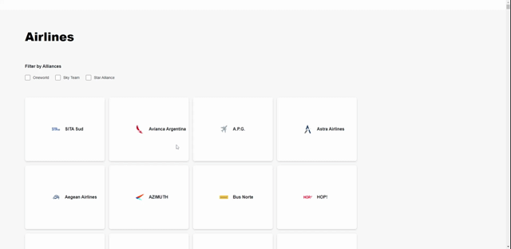

# Airline Alliance Filterlist

Single page application built with React with JSON populated Airline logo, name, alliance partner, number, and URL.

Users can filter search for 3 different alliances and hover over the airline card to get more details.

**See the hosted project [here](https://airlines-alliance-filterlist.netlify.app/).**



## Quick Start 🚀

### Install dependencies

```
npm install
```

### Run

```
npm run start
```

### Deploy

```
npm run deploy
```

### Author

[Zenia Gist](https://zeniagist.github.io)

### Version

1.0.0
